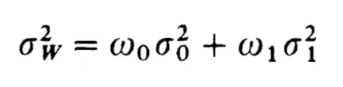
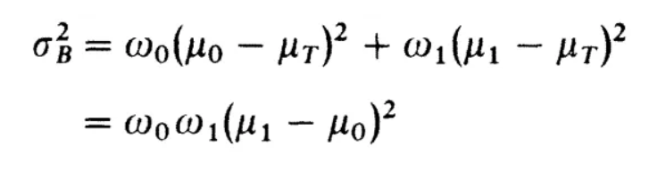

# Otsu_Thresholding
Dalam Repository ini akan diterapkan metode optimasi untuk melakukan thresholding pada citra digital. Metode Thresholding yang digunakan menggunakan **Algoritma Otsu** yakni sebuah cara untuk melakukan segmentasi pada citra digital dengan cara menentukan nilai ambang intensitas sehingga citra dapat disegmentasi menjadi dua kelas yakni *foreground* dan *background*.

## Kelompok 5
| Nama                     | NIM          |
| ------------------------ | ------------ |
| Abdullah Al Masyhur      | 162012233018 |
| Azka Muhammad Pinandito  | 162012233066 |
| Jasmine Adlina Hapsari   | 162112233019 |
| Kyrieleison Charla Frans | 162112233078 |

## Algoritma Thresholding Otsu

Algoritma ini bekerja dengan menganalisis histogram citra, yang mewakili distribusi intensitas piksel. Metode Otsu bertujuan untuk menemukan nilai threshold yang **meminimalkan** variabilitas dalam kelas (*Within class variability*) atau **memaksimalkan** variabilitas antar kelas (*Between class variability*). Sehingga terdapat 2 fungsi objektifnya seperti berikut :
- ***Within class variability***

- ***Between class variability***

  

Dengan mencapai ini, metode Otsu mengidentifikasi threshold yang paling baik membedakan wilayah *foreground* dan *background*, sehingga sangat berguna untuk tugas segmentasi citra.

Setelah threshold ditentukan, semua piksel dengan intensitas di bawah threshold akan ditetapkan ke kelas background, sementara piksel dengan intensitas di atas threshold akan ditetapkan ke kelas foreground. Proses thresholding ini memungkinkan ekstraksi objek atau wilayah yang menarik dari citra.

Keuntungan dari metode Otsu adalah memberikan pendekatan otomatis dan berbasis data untuk memilih threshold, menghilangkan kebutuhan untuk intervensi manual. Hal ini membuatnya banyak digunakan dalam berbagai aplikasi analisis citra, termasuk pengenalan objek, deteksi tepi, dan segmentasi citra.
