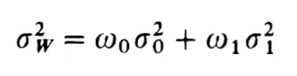
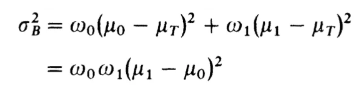

# Otsu_Thresholding
Dalam Repository ini akan diterapkan metode optimasi untuk melakukan thresholding pada citra digital. Metode Thresholding yang digunakan menggunakan **Algoritma Otsu** yakni sebuah cara untuk melakukan segmentasi pada citra digital dengan cara menentukan nilai ambang intensitas sehingga citra dapat disegmentasi menjadi dua kelas yakni *foreground* dan *background*.

## Kelompok 5
| Nama                     | NIM          |
| ------------------------ | ------------ |
| Abdullah Al Masyhur      | 162012233018 |
| Azka Muhammad Pinandito  | 162012233066 |
| Jasmine Adlina Hapsari   | 162112233019 |
| Kyrieleison Charla Frans | 162112233078 |

## Algoritma Thresholding Otsu

Algoritma ini bekerja dengan menganalisis histogram citra, yang mewakili distribusi intensitas piksel. Metode Otsu bertujuan untuk menemukan nilai threshold dengan cara mencari nilai **minimal** dari variabilitas dalam kelas (*Within class variability*) atau dengan cara mencari nilai **maksimal** dari variabilitas antar kelas (*Between class variability*). Sehingga terdapat 2 fungsi objektifnya seperti berikut :

- ***Within class variability***
  

- ***Between class variability*** 
  

  

Dengan mencapai ini, metode Otsu mengidentifikasi threshold yang paling baik membedakan wilayah *foreground* dan *background*, sehingga sangat berguna untuk tugas segmentasi citra. 

Setelah threshold ditentukan, semua piksel dengan intensitas di bawah threshold akan ditetapkan ke kelas *background*, sementara piksel dengan intensitas di atas threshold akan ditetapkan ke kelas *foreground*.

Keuntungan dari metode Otsu adalah memberikan pendekatan otomatis dan berbasis data untuk memilih threshold, menghilangkan kebutuhan untuk intervensi manual. Hal ini membuatnya banyak digunakan dalam berbagai aplikasi analisis citra, termasuk pengenalan objek, deteksi tepi, dan segmentasi citra.

Contoh penggunaan Algoritma Otsu : [Kode Program](https://github.com/thirdnostalgia/Otsu_Thresholding/blob/main/Otsu_Algorithm.ipynb)

##
## Implementasi Menggunakan Algoritma Optimasi *Genetic Algorithm*
Pada percobaan ini dilakukan 2 kali percobaan dengan parameter - parameter yang berbeda - beda :
- **Percobaan 1** :

  - Menggunakan ****Jupyter Notebook**** (.ipynb). [Kode Program](https://github.com/thirdnostalgia/Otsu_Thresholding/tree/main/Percobaan_1/Otsu_with_GA.ipynb)
  - Fungsi objektif dari Algoritma Otsu yang diguanakan adalah ***Within class variability***, sehingga targetnya adalah meminimalkan hasilnya.
  - Teknik **Seleksi** yang digunakan adalah ***Ordinal Based*** yaitu ***Ranking Selection*** atau ***Elitisme***. Dimana diambil setengah dari total populasi yang memiliki hasil fungsi objektif terendah dan dibuang setengah yang lainnya.
  - Teknik ***Crossover*** yang digunakan adalah ***single point crossover*** berdasarkan angka binernya.
  - Teknik **Mutasi** yang digunakan pada algoritma genetika tersebut adalah ***Random Resetting Mutation***. 
 
###
- **Percobaan 2** :
  -  Menggunakan ****Python**** (.py). Dengan dibagi menjadi beberapa kode yakni : [main.py](https://github.com/thirdnostalgia/Otsu_Thresholding/tree/main/Percobaan_2/main.py), [otsu.py](https://github.com/thirdnostalgia/Otsu_Thresholding/tree/main/Percobaan_2/otsu.py), [GA.py](https://github.com/thirdnostalgia/Otsu_Thresholding/tree/main/Percobaan_2/GA.py)
  - Fungsi objektif dari Algoritma Otsu yang diguanakan adalah ***Between class variability***, sehingga targetnya adalah memaksimalkan hasilnya.
  - Teknik **Seleksi** yang digunakan adalah ***Fitness Proportionate*** yaitu ***Roulette Wheel Selection***.
  - Teknik ***Crossover*** yang digunakan adalah ***One-Point Crossover*** dengan probabilitas 0.7.
  - Teknik **Mutasi** yang digunakan pada algoritma genetika tersebut adalah ***Bit Flip Mutation*** dengan probabilitas 0.01. 

##
#### Referensi

- https://www.geeksforgeeks.org/crossover-in-genetic-algorithm/
- https://www.geeksforgeeks.org/mutation-algorithms-for-string-manipulation-ga/
- https://medium.com/@vignesh.g1609/image-segmentation-using-otsu-threshold-selection-method-856ccdacf22
